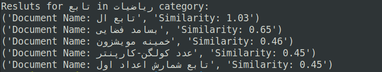
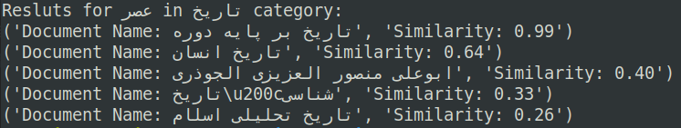

# Information-Retrieval

- `scraper.py`: Fetching Wikipedia persian documents in various categories.
- `code.py`: Search engine on the documents.
  1. Perform text normalization, stemming, etc.
  2. Create an inverted index and save it in file system.
  3. Receive a query and find the best matching category with Nearest Neighbor.
  4. Find top-k documents in the matching category with Tf-Idf.

### Sample Queries

  
  

